## initialize with pins Block
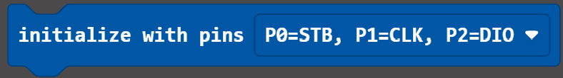

This block begins communication with the TM1638 board. Place this block before using any other TM1638 blocks. It is recommended to place this in the "on start" block as such:

### Example Usage
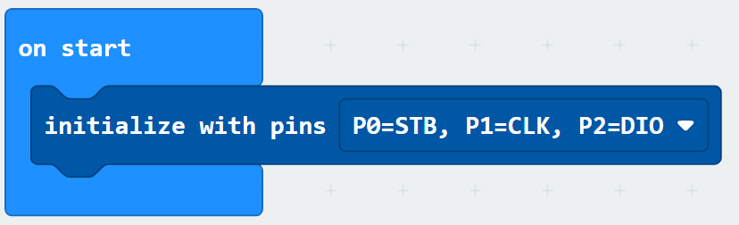

```javascript
TM1638.initialize(TM1638.PinOptions.Default)
```

This block also allows the user to change which pins of the micro:bit will be used. The default pins are P0, P1, and P2.
The alternative pin options are:

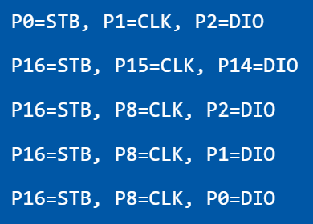

To utilize pins other than P0, P1, P2, 3V, and GND, an edge connector device will need to be used to make additional pins accessible.

To use different pins change 'Default' to 'AlternateOne', 'AlternateTwo', 'AlternateThree', or 'AlternateFour' depending on which pins are connected to your micro:bit based on the table below:
| Option          | Pins Used                       |
|-----------------|---------------------------------|
| Default         | P0 = STB, P1 = CLK, P2 = DIO    |
| AlternateOne    | P16 = STB, P15 = CLK, P14 = DIO |
| AlternateTwo    | P16 = STB, P8 = CLK, P2 = DIO   |
| AlternateThree  | P16 = STB, P8 = CLK, P1 = DIO   |
| AlternateFour   | P16 = STB, P8 = CLK, P0 = DIO   |

## set brightness to Block
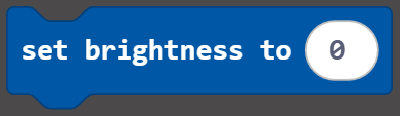

This block changes the board's brightness. A brightness of 0 is the least bright and a brightness of 7 is the most bright.

### Example Usage
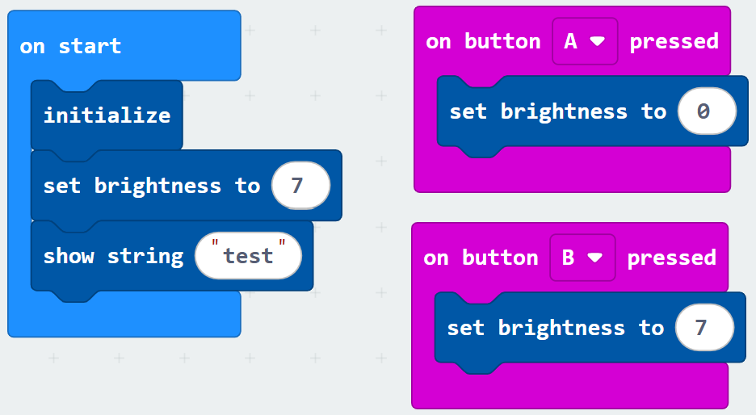

```javascript
TM1638.setBrightness(7)
```
Change the '7' to any integer 0 through 7

The brightness can also be changed at any time by using another set brightness to block.

## clear board Block
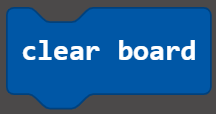

This block will turn off all of the seven segments and all of the LEDs.

### Example Usage
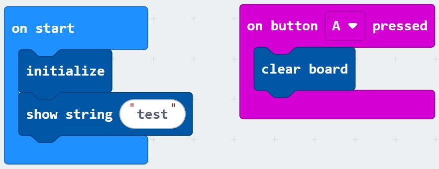

```javascript
TM1638.reset()
```

## show string Block
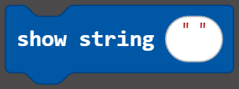

This block will display the entered text on the 8 seven segment displays. Any text entered above 8 characters will not be shown. Characters that cannot be represented on a seven segment display such as K, M, V, W, X, and special characters will instead be shown as space character (no segments will be on). Characters can be entered in either lowercase or uppercase; however, they will be displayed on the seven-segment display in the most legible way for each character.

### Example Usage
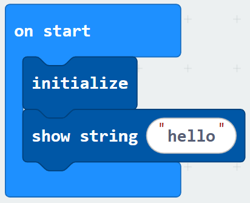

```javascript
TM1638.showString("hello")
```

If the user wants to show a number such as light level, temperature, etc., the "convert (number) to text" block under the included "Text" category can be used:

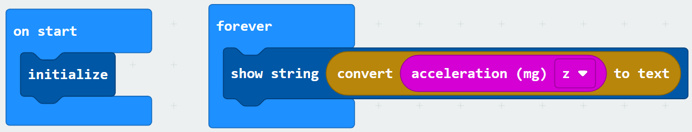

## scroll text Block
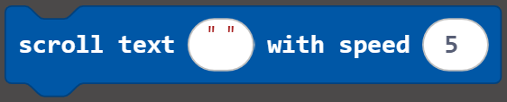

This block will scroll text from right to left. The allowed characters follow the same rules as the show string block however, more than 8 characters can be used.

### Example Usage
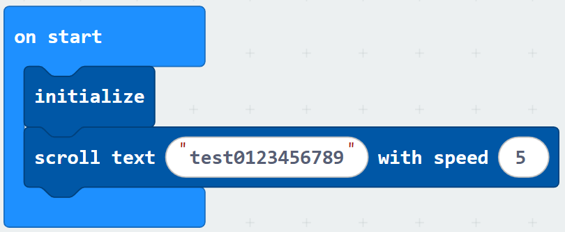

```javascript
TM1638.scrollText("test0123456789", 5)
```
The first input is the string to be displayed. The second input is the speed, this should be an integer from 1 to 10 (10 is fastest, 1 is slowest)

## Turn ON/OFF LEDs
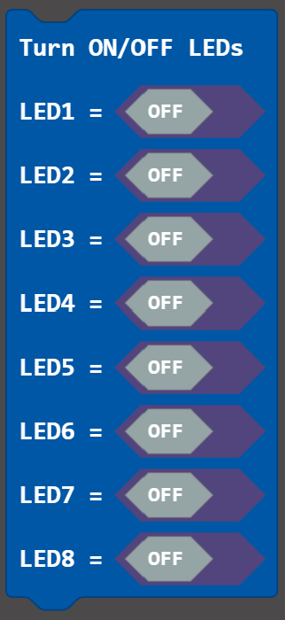

This block allows the user to enable or disable any of the 8 LEDs.

### Example Usage
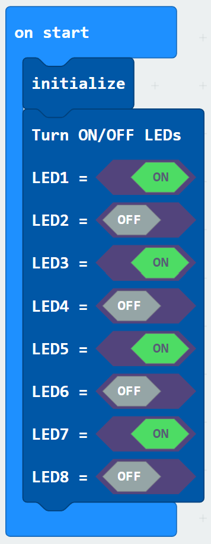

```javascript
TM1638.setLEDs(
true,
false,
true,
false,
true,
false,
true,
false
)
```
the first input is the first LED, a value of true means the LED is on and a value of false means the LED is off. Each subsequent input corresponds to the next LED so the 2nd input is the state of the 2nd LED, etc.

## turn decimal point <ON/OFF> at digit block
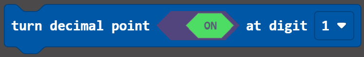

Turns on or off the decimal point on a specified seven segment display.

### Example Usage
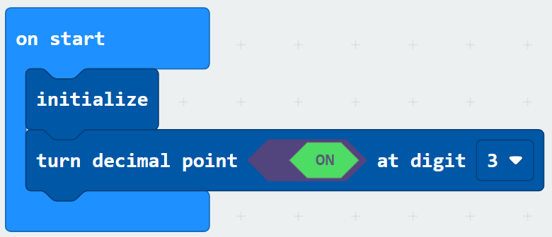

```javascript
TM1638.setDecimalPoint(TM1638.one_through_eight.Digit1, true)
```
Change 'Digit1' in the first input to 'Digit2', 'Digit3", etc. to change which seven segment decimal will be modified. The second input is true for turning on the decimal point and false for turning off the decimal point.

## Buttons Blocks
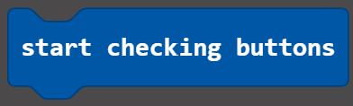

This block begins checking whether any buttons have been pressed. This block must be placed in order for the on button pressed blocks to work.

> **Note:** Button presses won't be registered while the screen is still scrolling text.

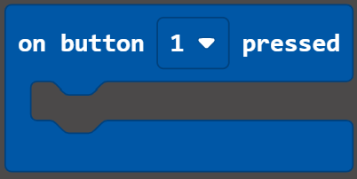

Blocks placed inside of this block will be run when the specified button on the TM1638 board is pressed. 

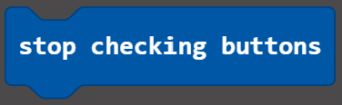

This block will make it so buttons pressed on the TM1638 board will no longer run the code under the on button pressed blocks.

### Example Usage
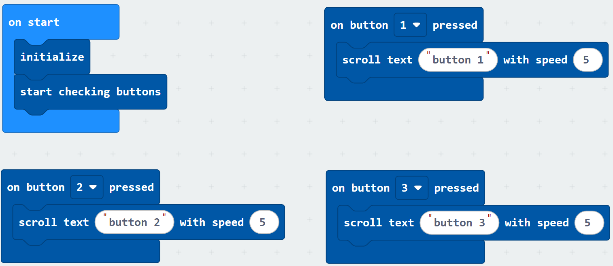

```javascript
TM1638.initialize()
TM1638.startCheckingButtons()
TM1638.onButtonPressed(TM1638.one_through_eight.Digit1, function () {
    TM1638.scrollText("button 1", 5)
})
```
To use any other buttons simply change 'Digit1' to 'Digit2' to use button 2 and 'Digit3' to use button 3, etc.

More information about the TM1638 board can be found [here](https://www.handsontec.com/dataspecs/display/TM1638.pdf).
TM1638 boards can be purchased cheaply from many online retailers. For the development of this extenstion, the HiLetgo TM1638 board was used, purchased from Amazon [here](https://a.co/d/8HQiDVi).


> Open this page at [https://nathanpervin.github.io/pxt-tm1638/](https://nathanpervin.github.io/pxt-tm1638/)

## Use as Extension

This repository can be added as an **extension** in MakeCode.

* open [https://makecode.microbit.org/](https://makecode.microbit.org/)
* click on **New Project**
* click on **Extensions** under the gearwheel menu
* search for **https://github.com/nathanpervin/pxt-tm1638** and import

## Edit this project

To edit this repository in MakeCode.

* open [https://makecode.microbit.org/](https://makecode.microbit.org/)
* click on **Import** then click on **Import URL**
* paste **https://github.com/nathanpervin/pxt-tm1638** and click import

#### Metadata (used for search, rendering)

* for PXT/microbit
<script src="https://makecode.com/gh-pages-embed.js"></script><script>makeCodeRender("{{ site.makecode.home_url }}", "{{ site.github.owner_name }}/{{ site.github.repository_name }}");</script>
